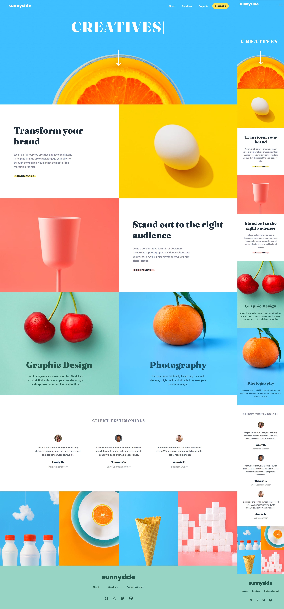

# Frontend Mentor - Sunnyside Agency Landing Page solution

This is my solution to the [Sunnyside agency landing page challenge on Frontend Mentor](https://www.frontendmentor.io/challenges/sunnyside-agency-landing-page-7yVs3B6ef)

## The challenge

Users should be able to:

- View the optimal layout for the site depending on their device's screen size
- See hover states for all interactive elements on the page

### Links

- Solution URL: [Add solution URL here](https://www.frontendmentor.io/challenges/sunnyside-agency-landing-page-7yVs3B6ef)
- Live Site URL: [Add live site URL here](https://jhon-okayda-sunnyside-landing-page.netlify.app/)

### Built with

- Semantic HTML5 markup
- SCSS
- Parcel
- CSS Flexbox
- CSS Grid
- Mobile-first (Layout)

## Author

- Created by - okayda-jhon
